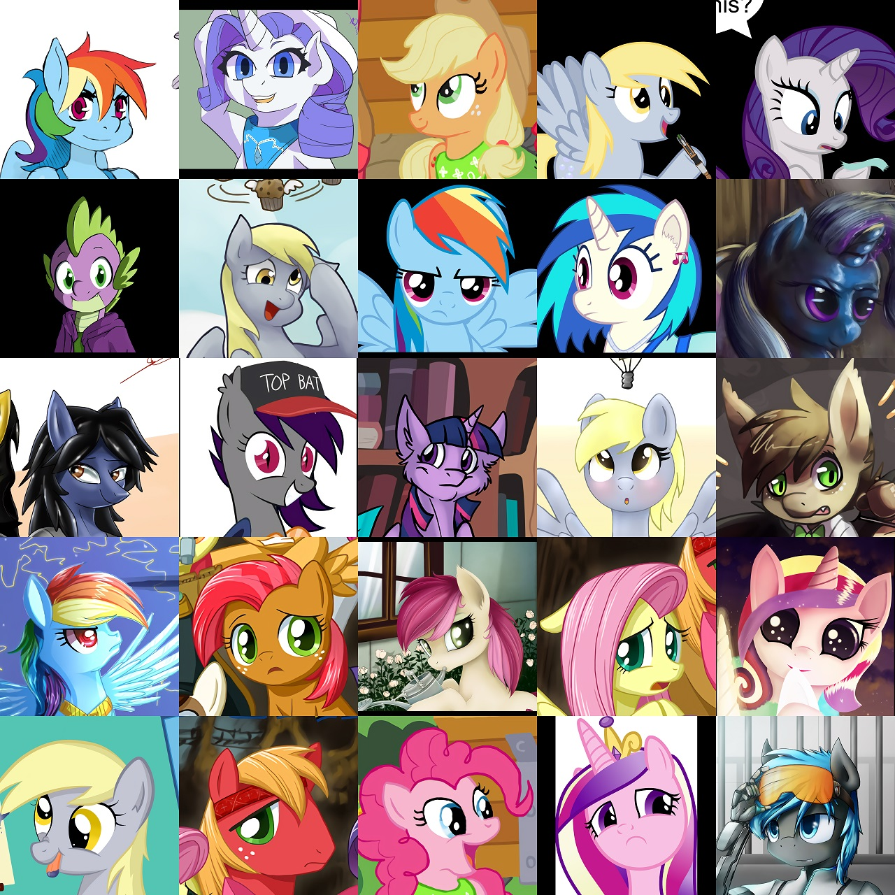
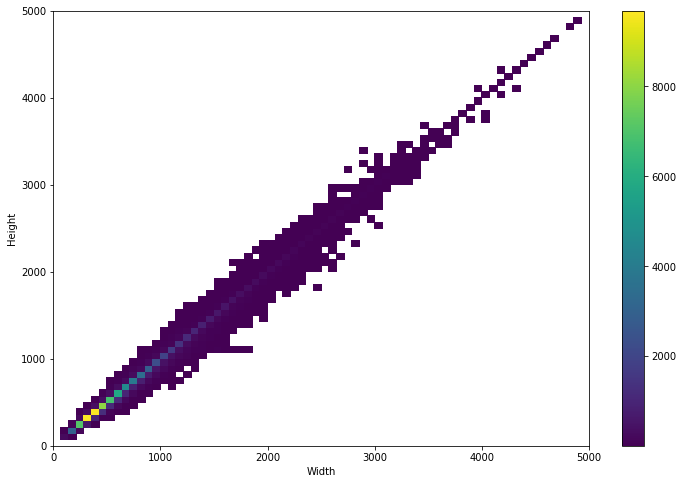
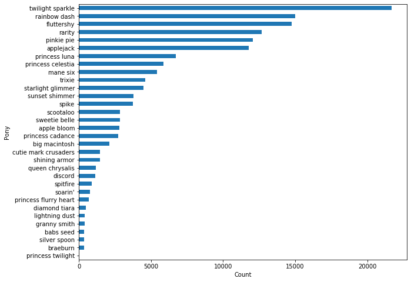

# MLP Faces Dataset
 A dataset of SFW cropped MLP faces from [Derpibooru](https://derpibooru.org/).



This dataset contains ~104k cropped MLP faces from Derpibooru. It was created by training a YOLOv3 network on annotated facial features from about 1500 faces.

Rather than provide the cropped images, this repo contains CSV files with the bounding boxes of the detected faces from my trained network, and a script to download the images from Derpibooru and crop them based on these CSVs.

The dimensions of the detected faces are shown in the following histogram:


The distribution of characters is shown below:


The list of images was filtered from the Derpibooru database using the following criteria:
```py
len(set(['safe', 'suggestive']).intersection(set(tags))) > 0 and len(set(['anthro', 'pony', 'pegasus', 'unicorn', 'alicorn', 'earth pony']).intersection(set(tags))) > 0 and score >= 25 and img_format.lower() in ['jpg', 'jpeg', 'png']
```

## Running

These instructions describe how to use this repository to prepare a dataset for training StyleGAN2.

First, download and install [aria2](https://aria2.github.io/).

Then, run
```
cat derpi_faces.csv | cut -d "," -f 2 | sort | uniq >> derpi_urls.lst
mkdir crop && cd crop
aria2c -x 16 -i ../derpi_urls.lst --continue=true
```

This will download the 91664 uncropped images from Derpibooru. It requires about 120GB of disk space.

Once this is done, run
```
python3 crop.py
```
to crop all of the images. The output images will be placed in directories according to their size:
* `downscale` for images > 1024x1024
* `waifu2x` for images between 512x512 and 1024x1024
* `waifu3x` for images between 341x341 and 512x512
* `waifu4x` for images smaller than 341x341

Run [waifu2x-chainer](https://github.com/tsurumeso/waifu2x-chainer) on each of these folders to upscale them to at least 1024x1024.

```
git clone https://github.com/tsurumeso/waifu2x-chainer
cd waifu2x-chainer
python3 waifu2x.py -m noise_scale -i ../crop/waifu2x/ -o ../crop/w2x/ -g 0 -s 2 -a 0 -n 3
python3 waifu2x.py -m noise_scale -i ../crop/waifu3x/ -o ../crop/w3x/ -g 0 -s 3 -a 0 -n 3
python3 waifu2x.py -m noise_scale -i ../crop/waifu4x/ -o ../crop/w4x/ -g 0 -s 4 -a 0 -n 3
```

Then run
```
python3 downscale.py
```
to downscale the upscaled images to exactly 1024x1024.

Finally, run
```
python3 premultiply_alpha.py
```
to premultiply the alpha channel by the color channels for each image, to preserve proper opacity during training.

You should then be able to convert the images in `crop/premult/` to tfrecords and train StyleGAN using them.


